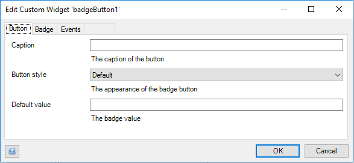
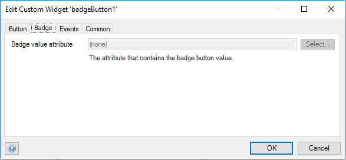

## Badge button

Badge button is a special distinctive mark or token put on any display as a button

## Features

 * Display a badge on a button.
 * Attach an onclick microflow 
 * Set a static label text when the persisted label is empty or not specified

## Dependencies

Mendix 7.1

## How it Works
When displaying badge button, the widget will prioritize context data specified in `Data source` tab data over static data specified in `Display` tab.
That is to say the widget label will show data from `Data source` tab over that from `Display` tab.
Likewise the widget value will show data from `Data source` tab over that from `Display` tab.

## Demo project

[https://badgebutton.mxapps.io/](https://badgebutton.mxapps.io/)

## Usage

Place the widget in the context of an object that has attributes for data, label and style

## Issues, suggestions and feature requests

We are actively maintaining this widget, please report any issues or suggestion for improvement at
https://github.com/mendixlabs/badge-button/issues.

## Developer
Prerequisite: Install git, node package manager, webpack CLI, grunt CLI, Karma CLI

To contribute, fork and clone.

    git clone https://github.com/FlockOfBirds/badge-button.git

The code is in typescript. Use a typescript IDE of your choice, like Visual Studio Code or WebStorm.

To set up the development environment, run:

    npm install

Create a folder named dist in the project root.

Create a Mendix test project in the dist folder and rename its root folder to MxTestProject. Changes to the widget code shall be automatically pushed to this test project.

    dist/MxTestProject

To automatically compile, bundle and push code changes to the running test project, run:

    grunt

To run the project unit tests with code coverage, results can be found at dist/testresults/coverage/index.html, run:

    npm test

or run the test continuously during development:

    karma start
